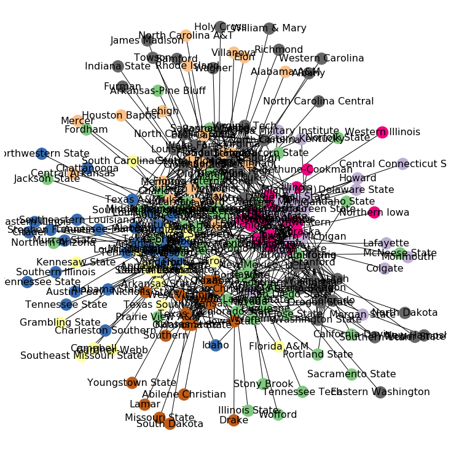
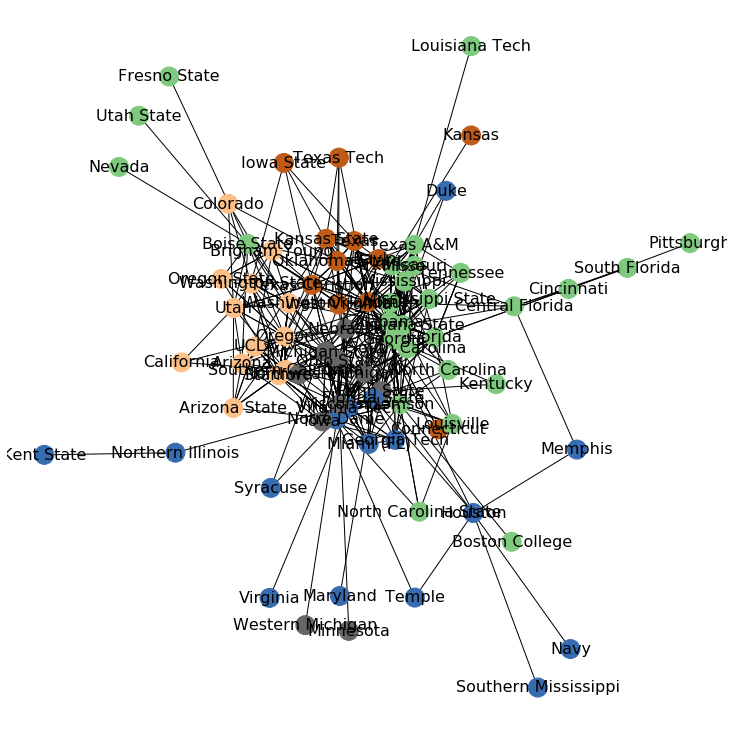
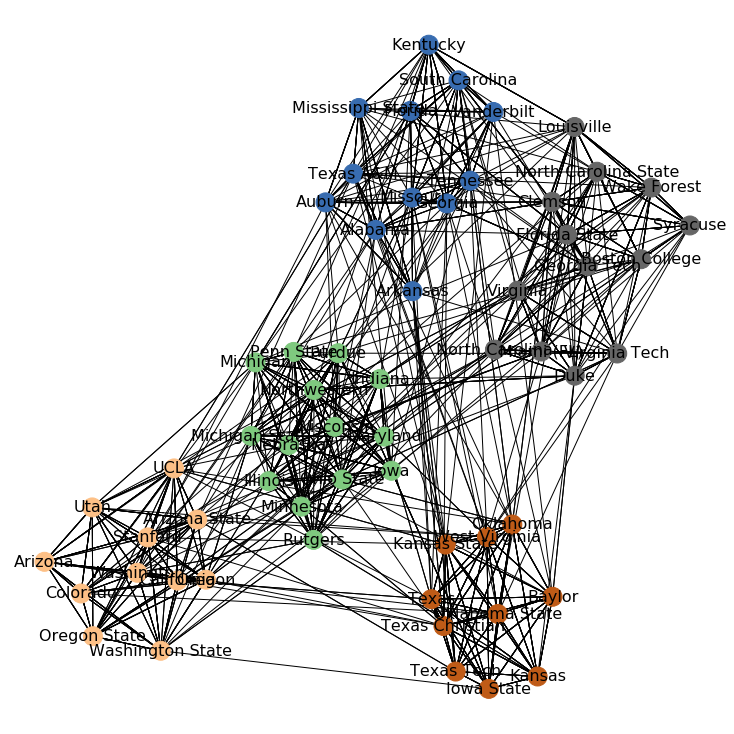
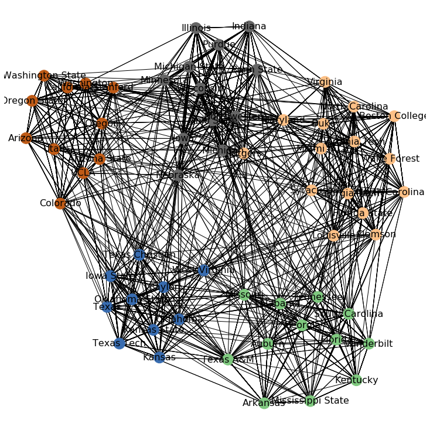

```python
import pandas as pd
import matplotlib.pyplot as plt
import networkx as nx
import community
import operator

%matplotlib inline
```

First we will read in the most recent data and run the same code from the "CF Analysis" notebook to condition and clean the data.


```python
records = pd.read_csv('scraped_results_df.csv')
# 'game_loc' indicated where the game was played at. Since the winner is listed first in 
# the original data, the '@' indicates the game was played at the loser's home.  Therefore, 
# we can create a new column called 'Winner_home' if the '@' sign is not present.
records['winner_home'] = records['game_loc']!='@'

# The rank is included in the winner and losers name within parenthesis.  The below regex will identify 
# numerical digits within the parenthesis and extract them to a new column as 'floats'.  We'll also 
# remove the rank in parenthesis from the original winner column.  We'll do this for winners and losers.
records['winner_rank'] = records['winner'].str.extract('\(([0-9]+)\)', expand=True).astype('float')
records['winner_name'] = records['winner'].str.replace('\(([0-9]+)\)', '').str.replace('\xa0', '')
records['loser_rank'] = records['loser'].str.extract('\(([0-9]+)\)', expand=True).astype('float')
records['loser_name'] = records['loser'].str.replace('\(([0-9]+)\)', '').str.replace('\xa0', '')

# Calculate a rank_diff socre.  The more negative this is, the more of an upset it is.
records['rank_diff'] = records['loser_rank'] - records['winner_rank']

# Add a pts_diff between the two pts as we can use margin of victory to see how close a 
# game is.
records['pts_diff'] = records['winner_pts'] - records['loser_pts']

# We no longer need several of these columns, so lets drop them.  
records.drop(['Unnamed: 0', 'winner','loser'], axis=1, inplace=True)

records.set_index(['year','week_number', 'row'], inplace=True)
```

## Develop a function to plot and explore communities in networks

The below function uses the "community" package, which employs the louvain method to identify communities and operates on top of networkx.  The function first creates a multigraph, then plots the network, applies the community module for community detection, and returns the "parts" of the community and their values.


```python
def plot_network(df):
    g = nx.from_pandas_edgelist(df, 'winner_name','loser_name', create_using=nx.MultiGraph)
    parts = community.best_partition(g)
    values = [parts.get(node) for node in g.nodes()]

    plt.figure(figsize=(10,10))
    nx.draw(g, cmap = plt.get_cmap('Accent'), node_color = values, node_size=360, font_size=16, with_labels=True)

    plt.show()
    return (parts, values)
```

## Network Exploration

First we'll plot all teams that played in 2018.  This network is incredibly dense, with teams that played the most against each other in the center.  Let's look at a way to look at a smaller subset of teams.


```python
network_2018 = plot_network(records.loc[2018])
```





This network limits the activity to games played between two ranked teams over the last 10 years.  It's less dense, but still difficult to follow.  Addittionally there are many nodes with few connections to others.


```python
ranked_last_10 = records[records['rank_diff'].notna()].loc[2009:2018]
ranked_last_10_network = plot_network(ranked_last_10)
```





The "parts" list that is an output from our function provides a list of each team and what community it ends up grouped in.  We can use this later to check our accuracy and explore how the teams are grouped together.


```python
sorted_parts = sorted(ranked_last_10_network[0].items(), key=operator.itemgetter(1))
sorted_parts[:5]
```


    [('Boise State', 0),
     ('Alabama', 0),
     ('Georgia', 0),
     ('Louisiana State', 0),
     ('Missouri', 0)]


```python
sorted_parts[-5:]
```


    [('Michigan State', 4),
     ('Michigan', 4),
     ('Northwestern', 4),
     ('Minnesota', 4),
     ('Western Michigan', 4)]


## Compare Detected Communities to Conferences from 2018

From the same site where we scraped the records of all games going back to 1950, we can also get the different conference break outs.  For this exploration, I had to downloaded 2018's final season wrap-up, which includes each team's conference.  To make the network a little cleaner, we will subset the teams down to just those in the "Power 5" conferences, and then plot the network activity between those teams.

### Identify all games played between Power Five teams


```python
conf = pd.read_csv('conf_2018.csv', header=1)
conf.head()
```


<div>
<style scoped>
    .dataframe tbody tr th:only-of-type {
        vertical-align: middle;
    }

    .dataframe tbody tr th {
        vertical-align: top;
    }

    .dataframe thead th {
        text-align: right;
    }
</style>
<table border="1" class="dataframe">
  <thead>
    <tr style="text-align: right;">
      <th></th>
      <th>Rk</th>
      <th>School</th>
      <th>Conf</th>
      <th>W</th>
      <th>L</th>
      <th>Pct</th>
      <th>W.1</th>
      <th>L.1</th>
      <th>Pct.1</th>
      <th>Off</th>
      <th>Def</th>
      <th>SRS</th>
      <th>SOS</th>
      <th>AP Pre</th>
      <th>AP High</th>
      <th>AP Rank</th>
      <th>Notes</th>
    </tr>
  </thead>
  <tbody>
    <tr>
      <td>0</td>
      <td>1</td>
      <td>Clemson</td>
      <td>ACC (Atlantic)</td>
      <td>15</td>
      <td>0</td>
      <td>1.000</td>
      <td>8</td>
      <td>0</td>
      <td>1.000</td>
      <td>44.3</td>
      <td>13.1</td>
      <td>26.45</td>
      <td>5.19</td>
      <td>2.0</td>
      <td>1.0</td>
      <td>1.0</td>
      <td>NaN</td>
    </tr>
    <tr>
      <td>1</td>
      <td>2</td>
      <td>Syracuse</td>
      <td>ACC (Atlantic)</td>
      <td>10</td>
      <td>3</td>
      <td>0.769</td>
      <td>6</td>
      <td>2</td>
      <td>0.750</td>
      <td>40.2</td>
      <td>27.0</td>
      <td>12.14</td>
      <td>1.30</td>
      <td>NaN</td>
      <td>12.0</td>
      <td>15.0</td>
      <td>NaN</td>
    </tr>
    <tr>
      <td>2</td>
      <td>3</td>
      <td>North Carolina State</td>
      <td>ACC (Atlantic)</td>
      <td>9</td>
      <td>4</td>
      <td>0.692</td>
      <td>5</td>
      <td>3</td>
      <td>0.625</td>
      <td>33.8</td>
      <td>24.9</td>
      <td>6.80</td>
      <td>0.49</td>
      <td>NaN</td>
      <td>16.0</td>
      <td>NaN</td>
      <td>NaN</td>
    </tr>
    <tr>
      <td>3</td>
      <td>4</td>
      <td>Boston College</td>
      <td>ACC (Atlantic)</td>
      <td>7</td>
      <td>5</td>
      <td>0.583</td>
      <td>4</td>
      <td>4</td>
      <td>0.500</td>
      <td>32.0</td>
      <td>25.7</td>
      <td>4.61</td>
      <td>1.78</td>
      <td>NaN</td>
      <td>17.0</td>
      <td>NaN</td>
      <td>NaN</td>
    </tr>
    <tr>
      <td>4</td>
      <td>5</td>
      <td>Wake Forest</td>
      <td>ACC (Atlantic)</td>
      <td>7</td>
      <td>6</td>
      <td>0.538</td>
      <td>3</td>
      <td>5</td>
      <td>0.375</td>
      <td>32.8</td>
      <td>33.3</td>
      <td>2.41</td>
      <td>2.41</td>
      <td>NaN</td>
      <td>NaN</td>
      <td>NaN</td>
      <td>NaN</td>
    </tr>
  </tbody>
</table>
</div>


```python
# Since the division (a subset of each conference) is included for each team, 
# we will use regular expressions to move the division to a separate column.
conf['Div'] = conf['Conf'].str.extract('\((\w+)\)', expand=True)
conf['Conf'] = conf['Conf'].str.replace('\((\w+)\)','')
conf.head()
```


<div>
<style scoped>
    .dataframe tbody tr th:only-of-type {
        vertical-align: middle;
    }

    .dataframe tbody tr th {
        vertical-align: top;
    }

    .dataframe thead th {
        text-align: right;
    }
</style>
<table border="1" class="dataframe">
  <thead>
    <tr style="text-align: right;">
      <th></th>
      <th>Rk</th>
      <th>School</th>
      <th>Conf</th>
      <th>W</th>
      <th>L</th>
      <th>Pct</th>
      <th>W.1</th>
      <th>L.1</th>
      <th>Pct.1</th>
      <th>Off</th>
      <th>Def</th>
      <th>SRS</th>
      <th>SOS</th>
      <th>AP Pre</th>
      <th>AP High</th>
      <th>AP Rank</th>
      <th>Notes</th>
      <th>Div</th>
    </tr>
  </thead>
  <tbody>
    <tr>
      <td>0</td>
      <td>1</td>
      <td>Clemson</td>
      <td>ACC</td>
      <td>15</td>
      <td>0</td>
      <td>1.000</td>
      <td>8</td>
      <td>0</td>
      <td>1.000</td>
      <td>44.3</td>
      <td>13.1</td>
      <td>26.45</td>
      <td>5.19</td>
      <td>2.0</td>
      <td>1.0</td>
      <td>1.0</td>
      <td>NaN</td>
      <td>Atlantic</td>
    </tr>
    <tr>
      <td>1</td>
      <td>2</td>
      <td>Syracuse</td>
      <td>ACC</td>
      <td>10</td>
      <td>3</td>
      <td>0.769</td>
      <td>6</td>
      <td>2</td>
      <td>0.750</td>
      <td>40.2</td>
      <td>27.0</td>
      <td>12.14</td>
      <td>1.30</td>
      <td>NaN</td>
      <td>12.0</td>
      <td>15.0</td>
      <td>NaN</td>
      <td>Atlantic</td>
    </tr>
    <tr>
      <td>2</td>
      <td>3</td>
      <td>North Carolina State</td>
      <td>ACC</td>
      <td>9</td>
      <td>4</td>
      <td>0.692</td>
      <td>5</td>
      <td>3</td>
      <td>0.625</td>
      <td>33.8</td>
      <td>24.9</td>
      <td>6.80</td>
      <td>0.49</td>
      <td>NaN</td>
      <td>16.0</td>
      <td>NaN</td>
      <td>NaN</td>
      <td>Atlantic</td>
    </tr>
    <tr>
      <td>3</td>
      <td>4</td>
      <td>Boston College</td>
      <td>ACC</td>
      <td>7</td>
      <td>5</td>
      <td>0.583</td>
      <td>4</td>
      <td>4</td>
      <td>0.500</td>
      <td>32.0</td>
      <td>25.7</td>
      <td>4.61</td>
      <td>1.78</td>
      <td>NaN</td>
      <td>17.0</td>
      <td>NaN</td>
      <td>NaN</td>
      <td>Atlantic</td>
    </tr>
    <tr>
      <td>4</td>
      <td>5</td>
      <td>Wake Forest</td>
      <td>ACC</td>
      <td>7</td>
      <td>6</td>
      <td>0.538</td>
      <td>3</td>
      <td>5</td>
      <td>0.375</td>
      <td>32.8</td>
      <td>33.3</td>
      <td>2.41</td>
      <td>2.41</td>
      <td>NaN</td>
      <td>NaN</td>
      <td>NaN</td>
      <td>NaN</td>
      <td>Atlantic</td>
    </tr>
  </tbody>
</table>
</div>


```python
conf['Conf'].value_counts()
```


    SEC          14
    ACC          14
    Big Ten      14
    CUSA         14
    Pac-12       12
    American     12
    MWC          12
    MAC          12
    Big 12       10
    Sun Belt     10
    Ind           6
    Name: Conf, dtype: int64


```python
# Notice that there are extra spaces after some of the conference names
power_5 = ['Big Ten ', 'SEC ', 'ACC ', 'Pac-12 ', 'Big 12']
power_5_teams_df = conf[conf['Conf'].isin(power_5)]
power_5_teams = power_5_teams_df['School'].to_list()
```

Now that we have a list of "Power Five" conferences, we can subset our data down just to games where both teams playing are in the Power Five.  These are the major players in College Football and still repersent a sizable portion of all games.


```python
power_5_recs = records[(records['winner_name'].isin(power_5_teams)) & (records['loser_name'].isin(power_5_teams))]
```


```python
power_5_recs.info()
```

    <class 'pandas.core.frame.DataFrame'>
    MultiIndex: 16959 entries, (1950, 2, 19) to (2018, 21, 884)
    Data columns (total 14 columns):
    winner_pts     16959 non-null float64
    loser_pts      16959 non-null float64
    game_date      16959 non-null object
    game_time      1702 non-null object
    game_day       16959 non-null object
    game_loc       6735 non-null object
    notes          1606 non-null object
    winner_home    16959 non-null bool
    winner_rank    7312 non-null float64
    winner_name    16959 non-null object
    loser_rank     3363 non-null float64
    loser_name     16959 non-null object
    rank_diff      1966 non-null float64
    pts_diff       16959 non-null float64
    dtypes: bool(1), float64(6), object(7)
    memory usage: 1.8+ MB


### Plot Power Five Conference Games

When we plot activity from the Power 5 conferences over the last 5 years, we get excellent distribution into accurate, well-defined communitites.


```python
power_5_recs_last_5 = power_5_recs.loc[2014:2018]
power_5_recs_last_5_network = plot_network(power_5_recs_last_5)
```





However, the plot of the same teams over the last 10 years is a bit messier.  For example, you can see two teams (Rutgers and Maryland) pulled between the ACC in tan and the Big Ten in grey.  This makes sense because these two teams changed conferences to the Big 10 in 2012.  We can see similar patterns with other teams like Texas A&M which moved from the Big 12 to the SEC.


```python
power_5_recs_last_10 = power_5_recs.loc[2009:2018]
power_5_recs_last_10_network = plot_network(power_5_recs_last_10)
```





### Explore Results of Network Analysis

We can use the parts and values lists from the community module to more effectively analyze the communities identified by the alogrithm.  Below, I created a new dataframe where I merge together the results from the approach with the known conferences.


```python
parts_df = pd.DataFrame.from_dict(power_5_recs_last_10_network[0], orient='index', columns=['part_number'])
results = pd.merge(power_5_teams_df, parts_df, left_on='School', right_index=True, how='left')
results
```


<div>
<style scoped>
    .dataframe tbody tr th:only-of-type {
        vertical-align: middle;
    }

    .dataframe tbody tr th {
        vertical-align: top;
    }

    .dataframe thead th {
        text-align: right;
    }
</style>
<table border="1" class="dataframe">
  <thead>
    <tr style="text-align: right;">
      <th></th>
      <th>Rk</th>
      <th>School</th>
      <th>Conf</th>
      <th>W</th>
      <th>L</th>
      <th>Pct</th>
      <th>W.1</th>
      <th>L.1</th>
      <th>Pct.1</th>
      <th>Off</th>
      <th>Def</th>
      <th>SRS</th>
      <th>SOS</th>
      <th>AP Pre</th>
      <th>AP High</th>
      <th>AP Rank</th>
      <th>Notes</th>
      <th>Div</th>
      <th>part_number</th>
    </tr>
  </thead>
  <tbody>
    <tr>
      <td>0</td>
      <td>1</td>
      <td>Clemson</td>
      <td>ACC</td>
      <td>15</td>
      <td>0</td>
      <td>1.000</td>
      <td>8</td>
      <td>0</td>
      <td>1.000</td>
      <td>44.3</td>
      <td>13.1</td>
      <td>26.45</td>
      <td>5.19</td>
      <td>2.0</td>
      <td>1.0</td>
      <td>1.0</td>
      <td>NaN</td>
      <td>Atlantic</td>
      <td>1.0</td>
    </tr>
    <tr>
      <td>1</td>
      <td>2</td>
      <td>Syracuse</td>
      <td>ACC</td>
      <td>10</td>
      <td>3</td>
      <td>0.769</td>
      <td>6</td>
      <td>2</td>
      <td>0.750</td>
      <td>40.2</td>
      <td>27.0</td>
      <td>12.14</td>
      <td>1.30</td>
      <td>NaN</td>
      <td>12.0</td>
      <td>15.0</td>
      <td>NaN</td>
      <td>Atlantic</td>
      <td>1.0</td>
    </tr>
    <tr>
      <td>2</td>
      <td>3</td>
      <td>North Carolina State</td>
      <td>ACC</td>
      <td>9</td>
      <td>4</td>
      <td>0.692</td>
      <td>5</td>
      <td>3</td>
      <td>0.625</td>
      <td>33.8</td>
      <td>24.9</td>
      <td>6.80</td>
      <td>0.49</td>
      <td>NaN</td>
      <td>16.0</td>
      <td>NaN</td>
      <td>NaN</td>
      <td>Atlantic</td>
      <td>1.0</td>
    </tr>
    <tr>
      <td>3</td>
      <td>4</td>
      <td>Boston College</td>
      <td>ACC</td>
      <td>7</td>
      <td>5</td>
      <td>0.583</td>
      <td>4</td>
      <td>4</td>
      <td>0.500</td>
      <td>32.0</td>
      <td>25.7</td>
      <td>4.61</td>
      <td>1.78</td>
      <td>NaN</td>
      <td>17.0</td>
      <td>NaN</td>
      <td>NaN</td>
      <td>Atlantic</td>
      <td>1.0</td>
    </tr>
    <tr>
      <td>4</td>
      <td>5</td>
      <td>Wake Forest</td>
      <td>ACC</td>
      <td>7</td>
      <td>6</td>
      <td>0.538</td>
      <td>3</td>
      <td>5</td>
      <td>0.375</td>
      <td>32.8</td>
      <td>33.3</td>
      <td>2.41</td>
      <td>2.41</td>
      <td>NaN</td>
      <td>NaN</td>
      <td>NaN</td>
      <td>NaN</td>
      <td>Atlantic</td>
      <td>1.0</td>
    </tr>
    <tr>
      <td>...</td>
      <td>...</td>
      <td>...</td>
      <td>...</td>
      <td>...</td>
      <td>...</td>
      <td>...</td>
      <td>...</td>
      <td>...</td>
      <td>...</td>
      <td>...</td>
      <td>...</td>
      <td>...</td>
      <td>...</td>
      <td>...</td>
      <td>...</td>
      <td>...</td>
      <td>...</td>
      <td>...</td>
      <td>...</td>
    </tr>
    <tr>
      <td>115</td>
      <td>116</td>
      <td>Texas A&amp;M</td>
      <td>SEC</td>
      <td>9</td>
      <td>4</td>
      <td>0.692</td>
      <td>5</td>
      <td>3</td>
      <td>0.625</td>
      <td>36.0</td>
      <td>25.3</td>
      <td>13.61</td>
      <td>7.15</td>
      <td>NaN</td>
      <td>16.0</td>
      <td>16.0</td>
      <td>NaN</td>
      <td>West</td>
      <td>0.0</td>
    </tr>
    <tr>
      <td>116</td>
      <td>117</td>
      <td>Mississippi State</td>
      <td>SEC</td>
      <td>8</td>
      <td>5</td>
      <td>0.615</td>
      <td>4</td>
      <td>4</td>
      <td>0.500</td>
      <td>28.5</td>
      <td>13.2</td>
      <td>13.24</td>
      <td>5.93</td>
      <td>18.0</td>
      <td>14.0</td>
      <td>NaN</td>
      <td>NaN</td>
      <td>West</td>
      <td>0.0</td>
    </tr>
    <tr>
      <td>117</td>
      <td>118</td>
      <td>Auburn</td>
      <td>SEC</td>
      <td>8</td>
      <td>5</td>
      <td>0.615</td>
      <td>3</td>
      <td>5</td>
      <td>0.375</td>
      <td>30.9</td>
      <td>19.2</td>
      <td>10.76</td>
      <td>5.60</td>
      <td>9.0</td>
      <td>7.0</td>
      <td>NaN</td>
      <td>NaN</td>
      <td>West</td>
      <td>0.0</td>
    </tr>
    <tr>
      <td>118</td>
      <td>119</td>
      <td>Ole Miss</td>
      <td>SEC</td>
      <td>5</td>
      <td>7</td>
      <td>0.417</td>
      <td>1</td>
      <td>7</td>
      <td>0.125</td>
      <td>33.9</td>
      <td>36.2</td>
      <td>2.81</td>
      <td>4.39</td>
      <td>NaN</td>
      <td>NaN</td>
      <td>NaN</td>
      <td>NaN</td>
      <td>West</td>
      <td>NaN</td>
    </tr>
    <tr>
      <td>119</td>
      <td>120</td>
      <td>Arkansas</td>
      <td>SEC</td>
      <td>2</td>
      <td>10</td>
      <td>0.167</td>
      <td>0</td>
      <td>8</td>
      <td>0.000</td>
      <td>21.7</td>
      <td>34.8</td>
      <td>-4.63</td>
      <td>4.96</td>
      <td>NaN</td>
      <td>NaN</td>
      <td>NaN</td>
      <td>NaN</td>
      <td>West</td>
      <td>0.0</td>
    </tr>
  </tbody>
</table>
<p>64 rows × 19 columns</p>
</div>


```python
results_clean = results[['School', 'Conf', 'part_number']]
results_clean.head()
```


<div>
<style scoped>
    .dataframe tbody tr th:only-of-type {
        vertical-align: middle;
    }

    .dataframe tbody tr th {
        vertical-align: top;
    }

    .dataframe thead th {
        text-align: right;
    }
</style>
<table border="1" class="dataframe">
  <thead>
    <tr style="text-align: right;">
      <th></th>
      <th>School</th>
      <th>Conf</th>
      <th>part_number</th>
    </tr>
  </thead>
  <tbody>
    <tr>
      <td>0</td>
      <td>Clemson</td>
      <td>ACC</td>
      <td>1.0</td>
    </tr>
    <tr>
      <td>1</td>
      <td>Syracuse</td>
      <td>ACC</td>
      <td>1.0</td>
    </tr>
    <tr>
      <td>2</td>
      <td>North Carolina State</td>
      <td>ACC</td>
      <td>1.0</td>
    </tr>
    <tr>
      <td>3</td>
      <td>Boston College</td>
      <td>ACC</td>
      <td>1.0</td>
    </tr>
    <tr>
      <td>4</td>
      <td>Wake Forest</td>
      <td>ACC</td>
      <td>1.0</td>
    </tr>
  </tbody>
</table>
</div>


We can now use this dataframe to find areas where the predicted value is different from the known conference.  As we can see here, something is wrong with the Big Ten.


```python
results_clean.groupby('Conf').mean()
```


<div>
<style scoped>
    .dataframe tbody tr th:only-of-type {
        vertical-align: middle;
    }

    .dataframe tbody tr th {
        vertical-align: top;
    }

    .dataframe thead th {
        text-align: right;
    }
</style>
<table border="1" class="dataframe">
  <thead>
    <tr style="text-align: right;">
      <th></th>
      <th>part_number</th>
    </tr>
    <tr>
      <th>Conf</th>
      <th></th>
    </tr>
  </thead>
  <tbody>
    <tr>
      <td>ACC</td>
      <td>1.000000</td>
    </tr>
    <tr>
      <td>Big 12</td>
      <td>2.000000</td>
    </tr>
    <tr>
      <td>Big Ten</td>
      <td>3.571429</td>
    </tr>
    <tr>
      <td>Pac-12</td>
      <td>3.000000</td>
    </tr>
    <tr>
      <td>SEC</td>
      <td>0.000000</td>
    </tr>
  </tbody>
</table>
</div>


When we look at just community 1, we can see that two teams, Maryland and Rutgers, are incorrectly associated.  All teams in community 1 should be in the ACC, but both Maryland and Rutgers were incorrectly associated because before 2012, they were part of the ACC and Big East respectively, which frequently played against ACC teams.  When we look at just the last five years in the previous network, both teams are correctly associated as part of the Big Ten because more games are played against other Big Ten teams within the last five years.

We could improve this analysis by importing the conference break-outs for every team for each year, but that analysis is beyond the scope of this project.


```python
results_clean[results_clean['part_number'] == 1]
```


<div>
<style scoped>
    .dataframe tbody tr th:only-of-type {
        vertical-align: middle;
    }

    .dataframe tbody tr th {
        vertical-align: top;
    }

    .dataframe thead th {
        text-align: right;
    }
</style>
<table border="1" class="dataframe">
  <thead>
    <tr style="text-align: right;">
      <th></th>
      <th>School</th>
      <th>Conf</th>
      <th>part_number</th>
    </tr>
  </thead>
  <tbody>
    <tr>
      <td>0</td>
      <td>Clemson</td>
      <td>ACC</td>
      <td>1.0</td>
    </tr>
    <tr>
      <td>1</td>
      <td>Syracuse</td>
      <td>ACC</td>
      <td>1.0</td>
    </tr>
    <tr>
      <td>2</td>
      <td>North Carolina State</td>
      <td>ACC</td>
      <td>1.0</td>
    </tr>
    <tr>
      <td>3</td>
      <td>Boston College</td>
      <td>ACC</td>
      <td>1.0</td>
    </tr>
    <tr>
      <td>4</td>
      <td>Wake Forest</td>
      <td>ACC</td>
      <td>1.0</td>
    </tr>
    <tr>
      <td>5</td>
      <td>Florida State</td>
      <td>ACC</td>
      <td>1.0</td>
    </tr>
    <tr>
      <td>6</td>
      <td>Louisville</td>
      <td>ACC</td>
      <td>1.0</td>
    </tr>
    <tr>
      <td>8</td>
      <td>Georgia Tech</td>
      <td>ACC</td>
      <td>1.0</td>
    </tr>
    <tr>
      <td>9</td>
      <td>Virginia</td>
      <td>ACC</td>
      <td>1.0</td>
    </tr>
    <tr>
      <td>10</td>
      <td>Miami (FL)</td>
      <td>ACC</td>
      <td>1.0</td>
    </tr>
    <tr>
      <td>11</td>
      <td>Virginia Tech</td>
      <td>ACC</td>
      <td>1.0</td>
    </tr>
    <tr>
      <td>12</td>
      <td>Duke</td>
      <td>ACC</td>
      <td>1.0</td>
    </tr>
    <tr>
      <td>13</td>
      <td>North Carolina</td>
      <td>ACC</td>
      <td>1.0</td>
    </tr>
    <tr>
      <td>40</td>
      <td>Maryland</td>
      <td>Big Ten</td>
      <td>1.0</td>
    </tr>
    <tr>
      <td>42</td>
      <td>Rutgers</td>
      <td>Big Ten</td>
      <td>1.0</td>
    </tr>
  </tbody>
</table>
</div>


